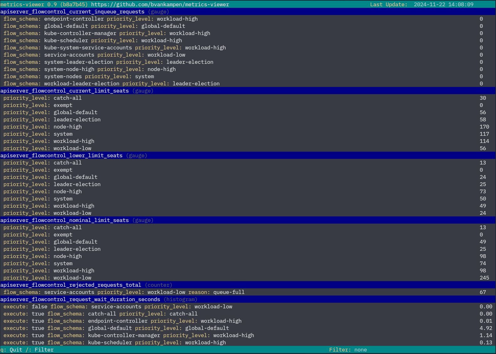

# Kubernetes Metrics Viewer

### Description

A CLI tools which can visualize Kubernetes metrics from the metrics-server, so you're able to watch these without installing Prometheus and Grafana on a cluster.

This project is a SUSE Hackweek 2024 project written by Volodymyr Katkalov and Bas van Kampen. More information about the project: [https://hackweek.opensuse.org/24/projects/metrics-server-viewer-for-kubernetes](https://hackweek.opensuse.org/24/projects/metrics-server-viewer-for-kubernetes)



### Requirements:

- go 1.23
- kubernetes cluster with the metrics server installed

### Usage:

```
metrics-viewer --help
NAME:
   metrics-viewer - a Kubernetes Metrics Viewer

USAGE:
   metrics-viewer [global options] command [command options] [arguments...]

VERSION:
   0.9 (b8a7b45)

AUTHORS:
   Volodymyr Katkalov <volodymyr.katkalov@suse.com>
   Bas van Kampen <bas.vankampen@suse.com>

COMMANDS:
   help, h  Shows a list of commands or help for one command

GLOBAL OPTIONS:
   --debug             Enable debug
   --kubeconfig value  Kubeconfig file (default: "~/.kube/config") [$KUBECONFIG]
   --config value      Config file (default: "~/.config/metrics-viewer.yaml") [$METRICS_VIEWER_CONFIG]
   --help, -h          show help
   --version, -v       print the version
```

### Configuration Example

If not config file is found (default: `~/.config/metrics-viewer.yaml`) then a new configuration file is generated.

```yaml
settings:
  scrape_interval: 1
metrics:
  - apiserver_flowcontrol_rejected_requests_total
  - apiserver_flowcontrol_current_inqueue_requests
  - apiserver_flowcontrol_request_wait_duration_seconds
  - apiserver_flowcontrol_current_limit_seats
  - apiserver_flowcontrol_lower_limit_seats
  - apiserver_flowcontrol_upper_limit_seats
  - apiserver_flowcontrol_nominal_limit_seats
```
